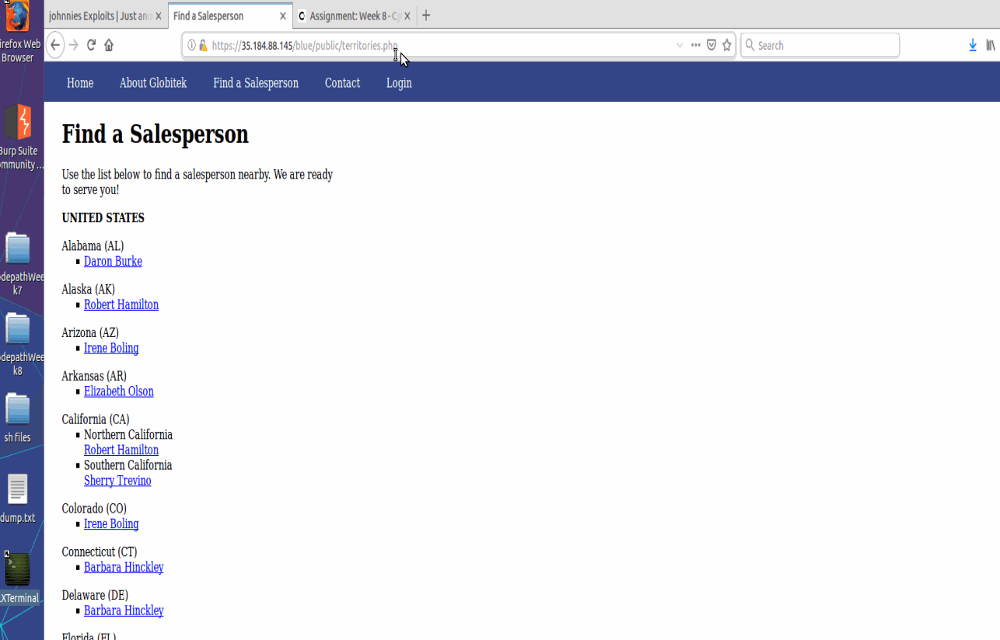
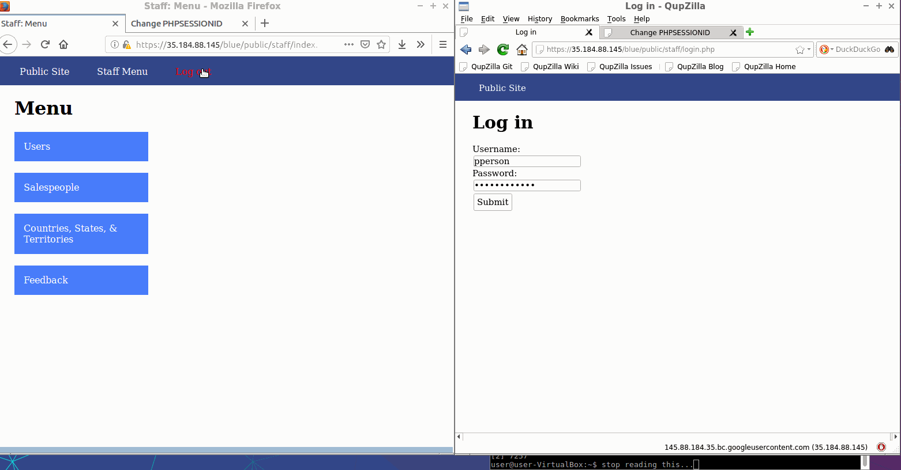
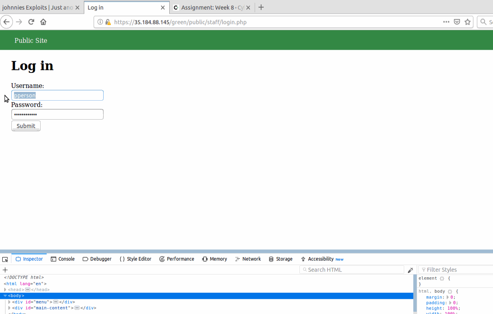
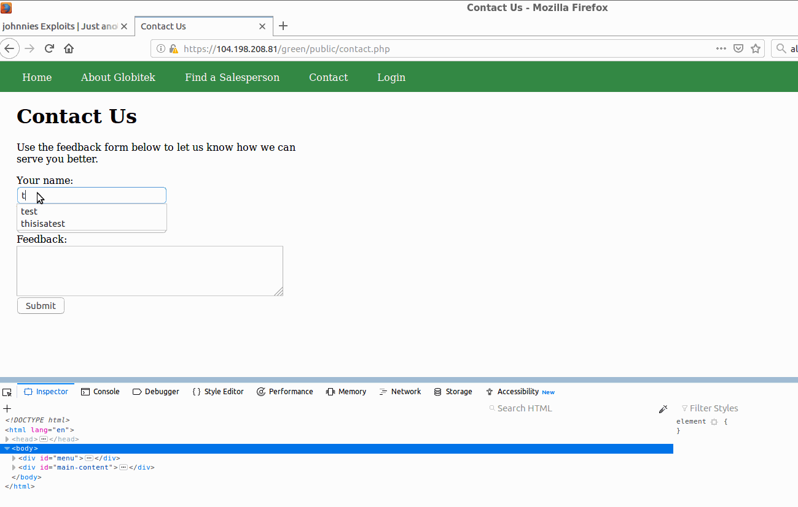
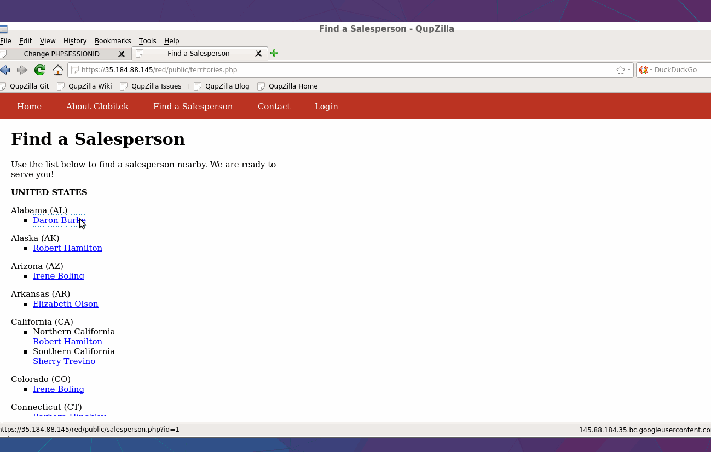
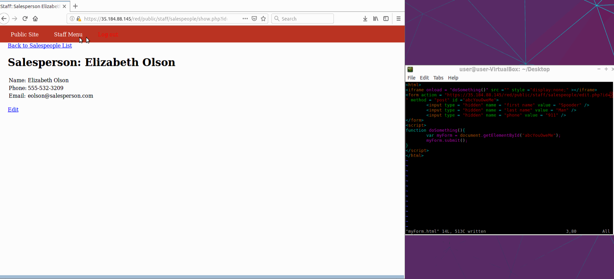

# Project 8 - Pentesting Live Targets

Time spent: **5** hours spent in total

> Objective: Identify vulnerabilities in three different versions of the Globitek website: blue, green, and red.

The six possible exploits are:
* Username Enumeration
* Insecure Direct Object Reference (IDOR)
* SQL Injection (SQLi)
* Cross-Site Scripting (XSS)
* Cross-Site Request Forgery (CSRF)
* Session Hijacking/Fixation

Each version of the site has been given two of the six vulnerabilities. (In other words, all six of the exploits should be assignable to one of the sites.)

## Blue

- [ ] Vulnerability #1: SQL Injection
  -Desc: Just by altering the URL, we can see that it is vulnerable to injection since it is readingthe user input as a command.

- [ ] Vulnerability #2: Session Hijacking
  -Desc: Using the session tool, we can steal the session and login!

## Green

- [ ] Vulnerability #1: Enumeration
  -Desc: Valid users appear bolded, fake ones are just regular. Can help the attacker find real usernames.

- [ ] Vulnerability #2: Stored XSS
  -Desc: We can inject js into the feedback mechanism and it will actually run it...

## Red

- [ ] Vulnerability #1: IDOR
  -Desc: Again altering the URL, we can find users we are not supposed to see.

- [ ] Vulnerability #2: CSRF
  -Desc: Wrote a short form that can be inserted on the feedback page using an iframe and script. When admin logs in and checks the feedback page, the script is ran within a hidden iframe and the user "Elisabeth Olson" is changed.

## Notes

Describe any challenges encountered while doing the work
Burp wouldn't load on vm that I downloaded... Didn't do anything to it but thought it would've been useful for this assignment :(
